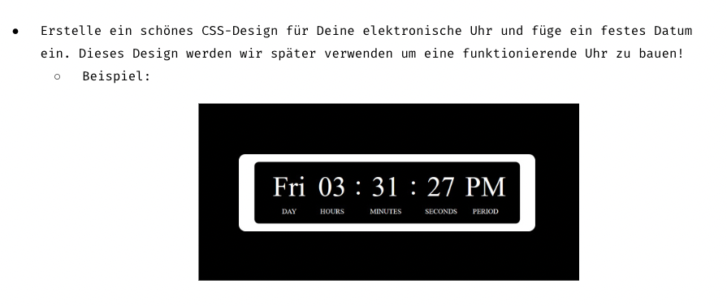
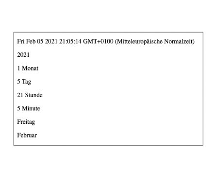

Vertiefung JavaScript – Date-Object

Eine Übung im SuperCode Bootcamp

## 🎓 Übung lev1_1: date new Date()

Aufgabenstellung

```
In dieser Übung werden wir Date() lernen.
Stelle die folgenden Daten im HTML-Dokument mit Hilfe des Befehls new Date() dar.

Speichere die Werte in einer Variable (date1, date2, …)
Nutze innerHTML um das Ergebnis darzustellen.
Teste dann die Werte:
new Date("September 2, 2019 09:00:00")
new Date(0)
new Date(31556908800)
new Date(86400000)

```

## 💡 Hinweis

Beachtet, dass es sich bei dem Date Object um eine Zeitangabe handelt. Daher ist die erste Zeile in der Ergebnisvorschau nicht tagesaktuell. ;)

<hr>

## 🎓 Übung lev1_2: Date Methods

Aufgabenstellung

```
In dieser Übung lernen wir die Date Methods
Zeige die Daten wie auf dem Screenshot an.
Verwende den Code aus dem Kommentarbereich, um den Wochentag und Monat anzuzeigen.
Nutze Google, wenn du nicht weiterkommst
Hinweis: du siehst hier das aktuelle Datum des Screenshots! Dein Ergebnis orientiert sich an dem aktuellen Datum.


```

## 🎓 Übung lev1_5: Monatsname

Aufgabenstellung

```
Schreibe eine Funktion, die den Monatsnamen anhand eines bestimmten Datums ermittelt.
Verwende den Code aus dem Kommentar.
Nutze getMonth() um die Aufgabe zu lösen.
Überprüfe deine Funktion mit folgenden Argumenten in der Konsole:
console.log(monatsName("2001,3,4")); //März
console.log(monatsName("2019,12,24")); //Dezember
console.log(monatsName("1410,07,15")); //Juli


```

## 🎓 Übung lev1_6: AM PM

Aufgabenstellung

```
Schreibe eine Funktion, um AM und PM zu erhalten.
Wenn die Uhrzeit kleiner als 12 Uhr ist, wird AM angezeigt.
Wenn die Uhrzeit größer als 12 Uhr ist, wird PM angezeigt.
Die Funktion enthält:
Ein Parameter
Ternary Operator oder if
getHours()
Überprüfe deine Funktion in der Konsole.
Teste sie mit folgenden Argumenten:
date1 = new Date(1999, 10, 5, 15) //PM
date2 = new Date()
date3 = new Date(2019, 12, 3, 12) //AM
date4 = new Date(2000, 1, 1, 11) //AM


```

## 🎓 Übung lev1_7: Weekend

Aufgabenstellung

```
Schreibe eine Funktion, die überprüft, ob an einem bestimmten Datum Wochenende ist oder nicht.
Schreibe eine Funktion und überprüfe dein Ergebnis in der Konsole.
Nutze:
Conditionals Statement
Comparison Operators
Funktion mit einem Parameter
Aktuelles Datum
getDay()
return "Weekend"
return "Arbeitstag"
Teste folgende Daten: 12.15.2019, 2.16.2001, 2.1.2020, 2.29.2020.


```

## 🎓Übung lev1_9: Clock

Aufgabenstellung

```
Zeige eine Uhr, die mit einem Timing-Event erstellt wurde.
Schreibe eine Funktion startTime(), die die aktuelle Uhrzeit anzeigt.
Der HTML-Code ist im Kommentar.
Definiere die Variablen im Funktionskörper:
heute mit dem aktuellen Datum.
std mit Stunden.
min mit Minuten.
sec mit Sekunden.
Nutze dazu den Code aus dem Kommentar.
Zeige das Ergebnis im HTML-Dokument mit Hilfe von getElementById()


```

## 📸 Screenshots




## 💻 Running

Zur Seite —> - [Vertiefung JavaScript – Date-Object](https://jennijennina.github.io/JS-Vertiefung_date_objects/)

<p align="left">
</p>

<h3 align="left">Languages and Tools:</h3>
<p align="left"> <a href="https://www.w3schools.com/html/" target="_blank" rel="noreferrer">  </a>
<a href="https://www.w3schools.com/css/" target="_blank" rel="noreferrer">  </a> 
<a href="https://www.w3schools.com/css/" target="_blank" rel="noreferrer">  </a> </p>
